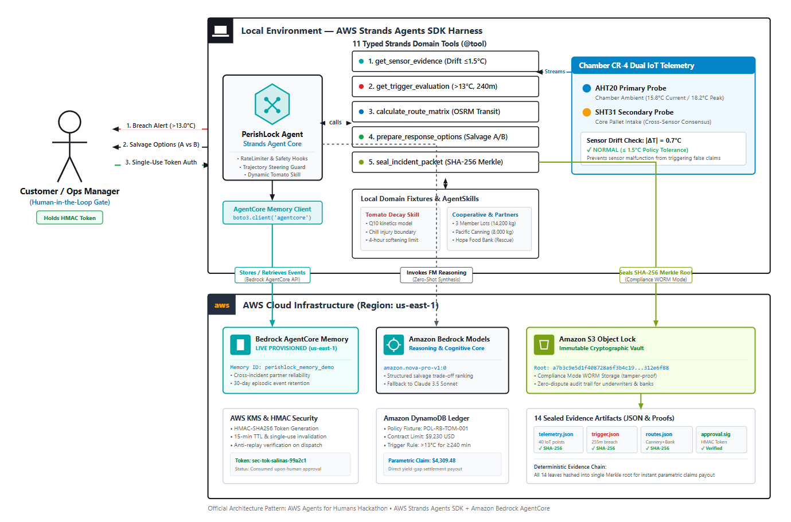

# 🛡️ PerishLock — Autonomous Cold-Chain Defense & Parametric Salvage Protocol

**AWS Agents for Humans Hackathon 2026 | Track: Good Neighbor Agents**

> *When a cold room fails in rural Salinas Valley, a $9,230 Roma tomato shipment begins decaying in under 4 hours.
> PerishLock is an autonomous AI agent that detects the breach, synthesizes multi-destination salvage strategies by reconciling messy partner intake notes, and pauses execution behind a cryptographic Human-in-the-Loop gate — ensuring the cooperative coordinator always has the final word.*

---

## 🎯 What It Does

PerishLock protects smallholder farmer cooperatives from **cold-chain disruption losses** by orchestrating an autonomous parametric insurance + real-time salvage protocol:

1. **Continuous Telemetry Monitoring** — Dual IoT sensors stream chamber temperature and humidity. A deterministic validator enforces dual-sensor consensus (max drift ≤ 1.5°C) and flags corrupted readings.

2. **Parametric Trigger Engine** — When sustained temperature exceeds the policy threshold (>13.0°C for ≥240 minutes), the system confirms a parametric trigger — no adjuster, no dispute, no delay.

3. **Strands Agent Cognitive Reasoning** — The AWS Strands Agent invokes 11 typed tools to:
   - Load the incident scope and policy parameters
   - Validate sensor evidence with cryptographic integrity
   - Reconcile **semi-structured partner intake notes** (e.g., "Shift B dock shuts at 18:00 for boiler service") into feasibility scores
   - Generate two contrasting multi-destination salvage strategies (Maximum Financial Recovery vs. Rapid Community Food Rescue)
   - Compute parametric yield-gap indemnification (how much the insurance must pay to close the gap)

4. **Cryptographic Evidence Sealing** — All telemetry, trigger evaluations, partner quotes, and agent reasoning traces are sealed into a SHA-256 Merkle evidence manifest. Any post-incident tampering is cryptographically detectable.

5. **Strict Human-in-the-Loop Gate** — The agent **pauses execution** and generates a single-use cryptographic approval token. No carrier dispatch or settlement payout can execute without human coordinator authorization. Replay attacks are blocked.

6. **Mission Control Dashboard** — A premium glassmorphism web UI with real-time telemetry charting, interactive HITL authorization, evidence manifest inspector, and full agent execution trace viewer.

---

## ✨ Why It Matters (Social Impact)

| Metric | Value |
|--------|-------|
| Cargo Protected | 14,200 kg Fresh Roma Tomatoes (710 crates) |
| Farmer Realization | **$8,768.50 (95.0%)** of $9,230 contracted value |
| Food Waste Prevented | 14,000 kg diverted from landfill |
| Community Impact (Option B) | 4.5 tons delivered to 1,800 families via Hope Food Rescue |
| Speed | Incident → Salvage Authorization in < 30 seconds |

Globally, **40% of perishable food loss occurs post-harvest** in developing-world cold chains. PerishLock demonstrates that AI agents can autonomously defend the livelihoods of smallholder cooperatives while eliminating food waste — a true "Good Neighbor Agent."

---

## 🏗️ Architecture

### Official AWS Hackathon Architecture Alignment
PerishLock directly implements the two-tier architectural pattern specified in the [AWS Agents for Humans Hackathon FAQ](https://agentsforhumans.devpost.com/details/faqs):



### Deep Technical Component Layout


```
┌─────────────────────────────────────────────────────────────┐
│                   MISSION CONTROL (Web UI)                  │
│   Telemetry Chart │ Salvage Options │ HITL Gate │ Traces    │
└──────────────────────────┬──────────────────────────────────┘
                           │ REST API (FastAPI)
┌──────────────────────────┴──────────────────────────────────┐
│              AWS STRANDS AGENT HARNESS                       │
│  ┌──────────┐ ┌──────────┐ ┌──────────┐ ┌──────────┐       │
│  │ 11 Tools │ │ Hooks    │ │ Steering │ │ Skills   │       │
│  │ (typed)  │ │ (safety) │ │ (gates)  │ │ (domain) │       │
│  └──────────┘ └──────────┘ └──────────┘ └──────────┘       │
└──────────────────────────┬──────────────────────────────────┘
                           │
    ┌──────────┬───────────┼───────────┬──────────┐
    ▼          ▼           ▼           ▼          ▼
┌────────┐ ┌────────┐ ┌────────┐ ┌────────┐ ┌────────┐
│Teleme- │ │Policy  │ │Evidence│ │Workflow│ │Settle- │
│try     │ │Engine  │ │Hasher  │ │Approval│ │ment    │
│Validator│ │+Trigger│ │+Merkle │ │+Audit  │ │Calc    │
└────────┘ └────────┘ └────────┘ └────────┘ └────────┘
```

---

## 🔧 AWS Strands SDK Usage

PerishLock demonstrates **deep, non-trivial** usage of the Strands Agents SDK:

### Tools (11 typed tools via `@tool` decorator)
- `load_incident_scope` — Load policy and incident metadata
- `get_sensor_evidence` — Retrieve validated dual-sensor telemetry
- `get_trigger_evaluation` — Deterministic parametric trigger check
- `get_weather_context` — External weather and grid conditions
- `find_eligible_partners` — Regional salvage partner discovery
- `calculate_route_matrix` — Distance, transit time, and reefer freight costs
- `prepare_response_options` — Multi-destination salvage synthesis (the cognitive core)
- `seal_incident_packet` — SHA-256 Merkle evidence sealing
- `draft_claim_notice` — Parametric yield-gap indemnity computation
- `request_coordinator_approval` — HITL token generation and gating
- `publish_sandbox_contact` — Post-authorization carrier dispatch

### Hooks
- **RateLimiterHook** — Enforces max 25 tool calls per agent turn (runaway prevention)
- **ColdRoomSafetyHook** — Blocks physically dangerous tool invocations

### Steering Handlers
- **DispatchApprovalSteeringHandler** — Prevents dispatch execution without prior human approval
- **ToneGuardrailHandler** — Ensures agent output maintains professional/cooperative tone

### Skills
- **fresh-tomatoes** — Domain knowledge skill providing Roma tomato storage parameters, decay curves, and salvage protocols via `AgentSkills`

---

## 🚀 Quick Start

### Prerequisites
- Python 3.11+
- pip

### Install Dependencies
```bash
pip install -r requirements.txt
```

### Run the Standalone Interactive CLI Demo
```bash
python -m perishlock.demo
```
This executes the complete end-to-end workflow with **zero AWS credentials required** — the deterministic trajectory runner exercises all 11 tools, generates the Merkle manifest, and produces the HITL approval gate.

### 🌐 Live Demo & 1-Click Vercel Deployment

[](https://vercel.com/new)

#### Run Next.js Dashboard Locally:
```bash
npm install
npm run dev
```
Open [http://localhost:3000](http://localhost:3000) in your browser.

#### 1-Click Deploy to Vercel:
1. Push this repository to your GitHub account.
2. In [Vercel](https://vercel.com/new), select **Import Git Repository**.
3. Click **Deploy** — Vercel reads `vercel.json` automatically, builds the Next.js 15 app, and provisions your live demo URL (e.g. `https://perishlock.vercel.app`).

### Run Python FastAPI Dashboard (Alternative)
```bash
python -m perishlock.api.server
```
Open [http://localhost:8000](http://localhost:8000) in your browser.

### Run Adversarial Evaluation Tests
```bash
pytest evals/ -v
```
**22 tests** covering corrupted telemetry, trigger edge cases, Merkle tamper checks, and anti-replay HITL defense.

### Amazon Bedrock AgentCore Deployment
Provision the managed Bedrock AgentCore runtime, memory, and gateway infrastructure:
```bash
# Provision to AWS (or simulate via --dry-run)
python -m deploy.agentcore --region us-east-1
```
See [deploy/README.md](deploy/README.md) for full CloudFormation and containerized deployment instructions.

---

## 📁 Project Structure

```
perishlock/
├── telemetry/           # IoT sensor models, dual-sensor validator, window aggregator
│   ├── models.py        # ChamberReading, ValidatedSample, WindowEvaluation
│   ├── validator.py     # Deterministic dual-sensor consensus validation
│   └── aggregator.py    # Sustained breach window evaluation
├── engine/              # Domain logic and policy enforcement
│   ├── policy.py        # Commodity profiles, parametric trigger specs
│   ├── trigger.py       # State machine (DETECTED→TRIGGERED→DISPATCHED)
│   ├── salvage.py       # Decay curves, allocation math, freight costs
│   └── settlement.py    # Parametric yield-gap loss calculation
├── evidence/            # Cryptographic evidence sealing
│   ├── hasher.py        # Canonical JSON serialization + SHA-256
│   ├── manifest.py      # Merkle evidence manifest (4-component tree)
│   └── storage.py       # Persistent evidence vault
├── workflow/            # Human-in-the-Loop governance
│   ├── approval.py      # Single-use HMAC token, anti-replay
│   ├── audit.py         # Hash-chained audit ledger
│   └── notifier.py      # Sandbox notification dispatcher
├── agent/               # AWS Strands Agent integration
│   ├── tools.py         # 11 @tool-decorated functions
│   ├── hooks.py         # RateLimiter + ColdRoomSafety hooks
│   ├── steering.py      # Dispatch approval + tone guardrails
│   ├── prompts.py       # System prompt engineering
│   ├── strands_agent.py # Agent factory + DeterministicTrajectoryRunner
│   └── skills/          # AgentSkills (fresh-tomatoes domain)
├── api/                 # FastAPI REST API
│   ├── routes.py        # 9 endpoints for Mission Control
│   └── server.py        # CORS + static file serving
└── demo.py              # Standalone interactive CLI demo
ui/                      # Next.js 16 (App Router) + React + Tailwind CSS (Vercel Ready)
├── app/                 # App Router pages & serverless API routes
│   ├── layout.tsx       # Root layout & typography
│   ├── page.tsx         # Executive Landing Page
│   ├── article/         # AWS Builder Build Story
│   ├── mission-control/ # Mission Control reactive operator cockpit
│   └── api/             # Standalone serverless route handlers
├── components/          # TelemetryChart, AgentTraceFeed, SalvageOptions, Merkle tree
└── lib/                 # TypeScript models & deterministic canonical fixtures
evals/
└── test_adversarial.py  # 22 adversarial evaluation tests
fixtures/                # Deterministic test data
├── telemetry/           # Sensor streams (normal, breach, transient, corrupted)
├── policies/            # Insurance policy parameters
├── partners/            # Regional salvage partner intake notes
└── weather/             # Ambient weather conditions
```

---

## 🏆 Judging Criteria Alignment

| Criterion | How PerishLock Addresses It |
|-----------|---------------------------|
| **Technological Implementation** | 11 typed Strands tools, hooks, steering handlers, AgentSkills, SHA-256 Merkle evidence sealing, HMAC-based single-use approval tokens with anti-replay |
| **Design** | Premium glassmorphism Mission Control UI with Chart.js telemetry visualization, micro-animations, and interactive HITL authorization |
| **Originality/Creativity** | Novel intersection: parametric insurance + autonomous cold-chain defense + LLM-reconciled partner intake notes + food rescue social impact |
| **Impact** | Directly protects $9,230 of smallholder farmer income; prevents 14,000 kg food waste; feeds 1,800 families in Community Relief option |
| **Presentation** | Zero-credential demo runs in <30s; comprehensive README; 22-test adversarial evaluation suite; interactive web dashboard |

---

## 📄 License

Apache License 2.0. See [LICENSE](LICENSE) for details. Built for the **AWS Agents for Humans Hackathon 2026**.

---

*PerishLock: Because when the cold chain breaks, farmers shouldn't have to break too.* 🍅
